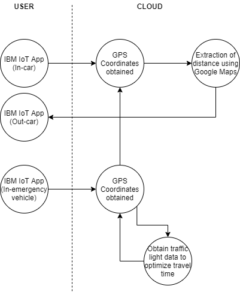

# HaroldAndKumars-SGSiren
An IoT solution to alert motorists of approaching emergency vehicles using the new in-vehicle unit to provide them with ample time to safely filter lanes and reduce travel time for emergency vehicles.

## **Contents**
1. [Short Description](#short-description)
1. [System Architecture](#system-architecture)
1. [Getting Started](#getting-started)
1. [Pitch Video](#pitch-video)
1. [Built With](#built-with)
1. [Long Description](#long-description)

## **Short Description**

### **The Problem**
Response time of emergency vehicles is a crucial factor in the civil defence force that could potentially save lives. Upon interviewing a few firefighters, we realized that traffic plays a huge role in determining the time taken for the SCDF to respond to emergencies. During peak traffic periods, it is difficult to manouver an emergency vehicles through congested roads as cars often have problems filtering out of the emergency lane.

### **The Solution**
We sought a way to reduce the time wasted by emergency vehicles negotiating traffic with the use of technology. Considering the fact that the new in-vehicle units would contain GPS capabilities, we decided to explore the use of this device to alert drivers of approaching emergency vehicles in advance, such that motorists would have ample time to make way for emergency vehicles. Furthermore, traffic lights could also be toggled to provide a hurdle-free route for emergency vehicles.

### **How can Technology Help?** 
The use of the IoT capabilities in IBM Cloud could allow for the sharing of IU data to alert motorists on the route set by the emergency vehicle. This GPS data could track vehicles and traffic lights within a proximity of 200m (or any other pre-set) distance along a particular route to alert motorists to begin filtering to give way for the emergency vehicles or toggling traffic lights to provide red-light free routes for emergency vehicles.

## **System Architecture**

## **Getting Started**
[Click here to redirect to app location](https://github.com/deveops/iot-starter-for-android/releases)

Once opened, you will be prompted to enter the following parameters:\
Organization: igndoh\
Device ID: 11223344 (to simulate car) AND 112233 (to simuluate EV)\
Auth Token: qwerty123 (for car)/ qwerty1234 (for EV)

## **Pitch Video**

## **Built With**
* [IBM Cloudant](https://cloud.ibm.com/catalog?search=cloudant#search_results) - The NoSQL database used
* [IBM Cloud Functions](https://cloud.ibm.com/catalog?search=cloud%20functions#search_results) - The compute platform for handing logic
* [IBM API Connect](https://cloud.ibm.com/catalog?search=api%20connect#search_results) - The web framework used
* [Node-Red](https://nodered.org/docs/getting-started/ibmcloud) - Platform to link IoT devices

## **Long Description**
* [Click here for more details.](DESCRIPTION.md)
